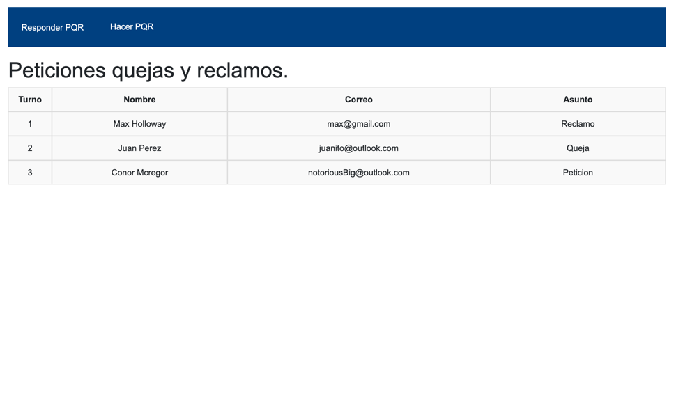
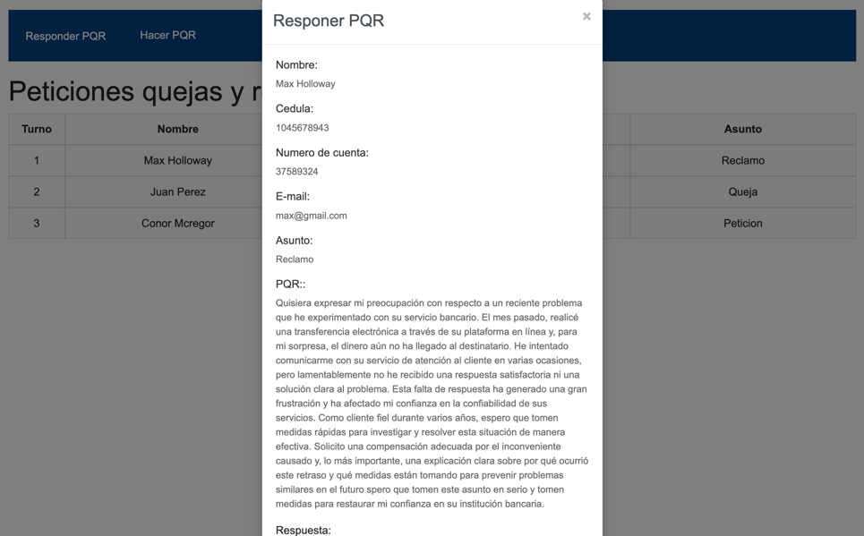
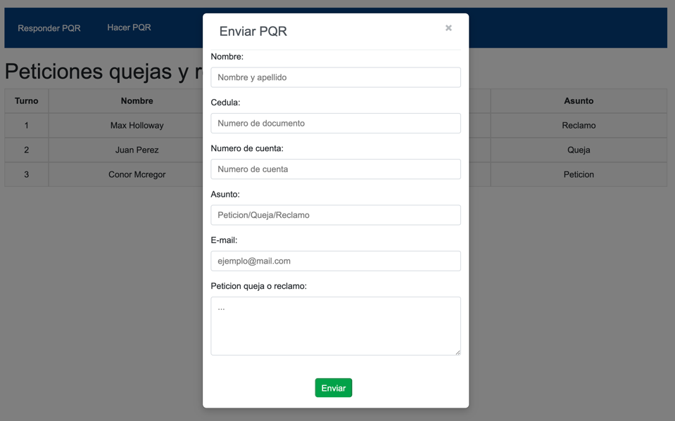

# Proyecto PQR – Queue

## Descripción:
Este proyecto pretende modelar el funcionamiento de un PQR (peticiones, quejas y 
reclamos) de una entidad bancaria, para esto se utilizó la clase Queue de java, ya que las 
PQR se responden de acuerdo al orden de llegada de la misma.

El proyecto cuenta con back-end y front-end. Para el back-end se utilizó Spring boot y 
para el front-end Angular.

## Back-end 

El proyecto  back-end cuenta principalmente con un controlador que es el tiene todas la funcionalidades.

### **Requisitos o prerrequisitos para ejecución:**

  - Jdk 17
  - Puerto Libre 8080
  - Verificar que el puerto este abierto y disponible
  - Windows 11 o superior
  - Linux-Sin Probar

### **Instalación**

- Crear una carpeta en el lugar de preferencia
- Copiar el jar en esta ubicación

### **Ejecución**
Dentro del proyecto hay un .jar del proyecto el cual se llama: **``queueProject-V_1.0.0.jar``**, y para poder utilizar este jar o mejor dicho ejecutarlo, sólo se debe abrir la consola de comandos dentro de esta carpeta y escribir: 
```
java –jar queueProject-V_1.0.0.jar
``` 
y el jar empezara a ejecutarse sin ningún problema.

### Documentation

La documentación del proyecto fue hecha con la ayuda de **swagger** por lo tanto esta se puede ver al correr el proyecto y escribir en el navegador:

```
http://localhost:808/doc/swagger-ui/index.html
```

[Documentation](http://localhost:8080/doc/swagger-ui/index.html)

## Front-end 

El proyecto  back-end cuenta principalmente con un controlador que es el tiene todas la funcionalidades.

### **Requisitos o prerrequisitos para ejecución:**

  - **`Node.js`** compatible con **`Angular Cli 16.2.13`**. En el caso de desarrollo se utilizó la versión **`18.20.1`**
  - **`Angular Cli 16.2.13`**
  - Puerto Libre **4200**
  - Verificar que el puerto este abierto y disponible
  - Windows 11 o superior
  - Linux-Sin Probar

### **Ejecución**
Para poder ejecutar este proyecto y que funcione correctamente, primero debe verificar que el backend se este ejecutando.

Luego se debe abrir la consola de comandos dentro del proyecto y escribir: 
```
ng serve --open
``` 
Muy posiblemente se le va a pedir que conseda un permiso, a lo que dirá que sí (es necesario para ejecutar este script), luego se abrirá una nueva pestaña en su navegador y allí estará el proyecto. El cuál ya puede ser utilizado.

## ScreenShots





## Herramientas utilizadas

 

### Lenguajes y Frameworks

       

## Desarrollado por:
- [Andres Vergara Sánchez](https://github.com/HugoAVS)
- [Fredy Oswaldo López](https://github.com/fredylopez01)